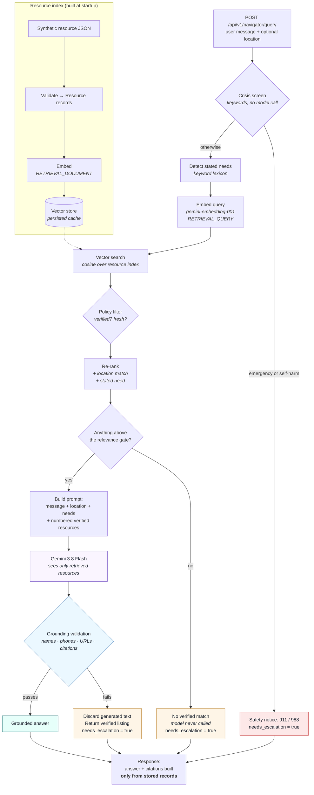

# Health Equity Navigator

A retrieval-augmented API that helps community members find verified local health
and social-support resources — transportation to appointments, food assistance,
housing help, caregiver support, interpreters, accessible services, and clinics
that see uninsured patients.

The hard part of this problem is not generating text. It is making sure the
service never sends someone to a door that is not there. A hallucinated clinic
name and a plausible-looking phone number are worse than no answer at all, so
this codebase is built around a single rule: **every organization, phone number,
and link in a response comes from a verified record, and generated text that
strays outside its retrieved context is discarded rather than returned.**

Runtime AI is **Google Gemini on Vertex AI**. All resource data in this
repository is **synthetic** — see [Data](#data).

---

## How it works



Four paths produce an answer, and only one of them involves a model writing
prose. That is deliberate: the crisis path, the no-match path, and the
grounding-failure path are all deterministic, so the cases where being wrong
matters most never depend on a model's judgement.

---

## Features

| | |
| --- | --- |
| **Semantic retrieval** | Vertex AI embeddings with asymmetric task types (`RETRIEVAL_DOCUMENT` for resources, `RETRIEVAL_QUERY` for questions), exact cosine search, and a relevance gate tuned from a labelled evaluation set rather than guessed. |
| **Equity-aware ranking** | Location *boosts* rather than filters, so someone in one city still sees statewide services. Explicitly stated needs outrank incidental context — "my mother needs wheelchair-accessible support" is about a wheelchair, not caregiving. |
| **Verification policy** | Unverified records, and records whose last human verification is older than a configurable window, are withheld from every response. |
| **Grounded generation** | Gemini sees only the retrieved resources. Citations are projected from stored records, never parsed from generated text. |
| **Post-generation validation** | Every answer is checked for invented organizations, phone numbers, links, and out-of-range citations before it is returned. |
| **Crisis handling** | A deterministic screen routes emergencies and self-harm language to 911/988 before retrieval or generation runs. |
| **Explicit escalation** | `needs_escalation` and `escalation_reason` tell a caller when a person should pick the request up. |
| **Swappable providers** | `LLMService`, `EmbeddingService`, and `VectorStore` are abstractions; the whole service runs offline with no cloud credentials. |
| **Production hardening** | Body-size cap, per-client rate limit, request deadline, security headers, structured JSON logs, and per-request metrics that never include the user's message. |
| **Evaluation suite** | 41 labelled end-to-end cases plus 32 retrieval cases, with threshold tuning and a latency benchmark. |

---

## Tech stack

**Python 3.12** · **FastAPI** · **Pydantic v2 / pydantic-settings** ·
**google-genai** (Vertex AI) · **NumPy** · **pytest** · **Ruff** · **Docker**

Authentication to Google Cloud is **Application Default Credentials only** — no
API keys, no service-account files, nothing to commit.

---

## Safety and grounding

Prompting a model to stay grounded is necessary but never sufficient, so the
grounding contract is enforced in four independent places:

**1. The model only ever sees verified resources.** If retrieval returns nothing
above the relevance gate, no request is sent at all. The service says plainly
that it has no verified match and points to 211. The same holds if retrieval
itself fails — a broken index must never become a guessed answer.

**2. Citations cannot be hallucinated by construction.** The `resources` array is
projected from the retrieved `Resource` objects. Whatever the model writes, it
cannot put an organization into that array.

**3. Generated text is validated after the fact.**

| Check | Confidence | What it catches |
| --- | --- | --- |
| Phone numbers and URLs appear in the retrieved set | Exact | A fabricated contact detail — the most dangerous failure mode |
| `[n]` citations index a resource in context | Exact | Citations pointing at nothing |
| Organization names match retrieved names | Heuristic | An invented organization |

Any failure **discards the generated text entirely** and falls back to a listing
assembled from records. Being clear about the limit: the name check catches an
invented organization, not a subtly wrong claim about a real one.

**4. The user's message is treated as data, not instructions.** It is fenced in
explicit delimiters, and the system prompt states that nothing inside them can
change the rules. Six prompt-injection cases in the evaluation suite verify this.

Two further guarantees: a response that hits the output-token cap is discarded
rather than shown ending mid-sentence, and **no relevance or similarity score is
ever exposed** through the API — scores are not comparable across embedding
providers, and a number printed beside a community organization reads as a
judgement about that organization.

---

## Results

Measured end to end against live Vertex AI, 41 labelled cases spanning typos,
vague requests, several needs in one message, non-English phrasing, prompt
injection, off-topic questions, unanswerable questions, and queries whose
best-looking match is a deliberately withheld record.

| Measure | Result |
| --- | --- |
| Retrieval accuracy (top-1 category) | 95.8% |
| Grounded-answer rate | 100% |
| Hallucination rejection rate | 100% |
| No-match accuracy | 100% |
| Escalation accuracy | 100% |
| **Leak rate** (must be zero) | **0.0%** |
| Withheld records cited (must be zero) | **0** |

*Configuration: `gemini-3.8-flash`, `GEMINI_THINKING_LEVEL=low`.*

Leak detection is deliberately independent of the service: every returned answer
is re-validated against the resources that request actually retrieved, so
anything the service should have caught but did not would surface as a leak.

**Retrieval-only evaluation** (32 labelled queries): 100% top-1 category
accuracy, 100% recall@3, 100% off-topic rejection with Vertex embeddings.

**Latency** (mean / p50 / p95): 5.2 s / 3.6 s / 15.0 s end to end. Generation
dominates. A benchmark comparing thinking levels found `low` **83% faster with no
measurable quality loss**, which is why it is the recommended configuration.

**Tests**: 279 passing. `ruff check` and `ruff format --check` clean.

```bash
pytest
ruff check . && ruff format --check .
```

---

## Quick start

Runs fully offline — no Google Cloud project, no credentials, no network.

```bash
python3.12 -m venv .venv && source .venv/bin/activate
```

```bash
pip install -e ".[dev]"
```

```bash
cp .env.example .env
```

```bash
uvicorn app.main:app --reload --port 8080
```

Interactive docs at <http://127.0.0.1:8080/docs>.

The defaults (`LLM_PROVIDER=stub`, `EMBEDDING_PROVIDER=hashing`) use an offline
deterministic provider so the whole pipeline — routing, retrieval, ranking,
grounding validation — is exercisable anywhere. The offline embeddings match on
shared wording rather than meaning; real semantic retrieval needs Vertex.

### Try it without the API

```bash
python scripts/demo_navigator.py          # full pipeline, several example needs
python scripts/try_retrieval.py           # retrieval only
python scripts/eval_navigator.py          # the end-to-end evaluation suite
```

---

## Vertex AI configuration

Authentication is Application Default Credentials. There is no API key.

```bash
gcloud auth application-default login
```

```bash
gcloud services enable aiplatform.googleapis.com --project YOUR_PROJECT_ID
```

Then in `.env`:

```bash
LLM_PROVIDER=vertex
EMBEDDING_PROVIDER=vertex
GOOGLE_CLOUD_PROJECT=your-gcp-project-id
GOOGLE_CLOUD_LOCATION=global
GEMINI_MODEL=gemini-3.8-flash
GEMINI_THINKING_LEVEL=low
```

The calling principal needs **Vertex AI User** (`roles/aiplatform.user`).

Verify the connection end to end:

```bash
LLM_PROVIDER=vertex python scripts/verify_vertex.py
```

Setting a Vertex provider without the Google settings fails at **startup**, not
on the first user request.

---

## API

### `POST /api/v1/navigator/query`

```bash
curl -X POST http://127.0.0.1:8080/api/v1/navigator/query \
  -H "Content-Type: application/json" \
  -d '{"query": "I need a ride to my dialysis appointment.", "location": "Oakland"}'
```

```json
{
  "request_id": "0a78c7fc-1664-4383-a3a2-f4f0fbee83a5",
  "answer": "The best program to help you is Eastbay Rides to Care [1]. They provide free door-to-door rides to medical visits, including dialysis appointments, for adults in Oakland who cannot drive. They do not require insurance, and they have wheelchair-accessible vans if you ask in advance. You can call them at 555-0142.",
  "provider": "vertex",
  "model": "gemini-3.8-flash",
  "resources": [
    {
      "resource_id": "syn-transport-001",
      "title": "Eastbay Rides to Care",
      "categories": ["transportation", "accessibility_support"],
      "phone": "555-0142",
      "url": "https://example.org/eastbay-rides-to-care",
      "service_area": "Oakland, Berkeley, Alameda, CA",
      "eligibility": "Adults 18+ with a scheduled medical appointment and no reliable transportation. No insurance required.",
      "languages": ["English", "Spanish", "Cantonese"],
      "accessibility": ["wheelchair accessible vehicles", "door-to-door assistance"],
      "cost": "free",
      "last_verified": "2026-07-15"
    }
  ],
  "retrieval_performed": true,
  "needs_escalation": false,
  "escalation_reason": null,
  "answer_source": "generated",
  "disclaimer": "This is general information about community resources, not medical, legal, or financial advice…",
  "latency_ms": 3412
}
```

**Request fields**: `query` (3–2000 chars, required), `location`, `language`,
`categories`, `max_resources` (1–20), `session_id`.

**`answer_source`** is `generated`, `verified_listing` (model output was rejected
or unavailable), `no_match`, or `safety_notice`.
**`escalation_reason`** is one of `no_verified_resources`, `grounding_failed`,
`answer_truncated`, `possible_crisis`, `retrieval_unavailable`, or
`generation_unavailable`.

Send `X-Request-ID` to correlate logs; it is echoed back.

### `GET /health`

```json
{"status": "ok", "service": "Health Equity Navigator", "version": "0.1.0",
 "environment": "local", "llm_provider": "vertex",
 "embedding_provider": "vertex", "resources_indexed": 24}
```

---

## Data

**Everything in this repository is synthetic.** `app/data/sample_resources.json`
holds 24 invented organizations covering every service category; phone numbers
use the 555 reserved range and every website points at `example.org`. The
evaluation sets contain invented user messages. There is no real organization, no
patient data, and no private data of any kind anywhere in this repository.

`app/data/eval_decoy_resources.json` holds five records that are deliberately
stale or unverified and would rank *first* for their query. They exist so the
evaluation can prove the verification and freshness filters hold in the real
pipeline rather than only in a unit test.

---

## Project layout

```
app/
  main.py                      FastAPI app factory, middleware, lifespan
  api/middleware.py            size cap, rate limit, deadline, security headers
  api/v1/routes/               health.py, navigator.py
  core/config.py               all settings, environment-driven
  core/logging.py              text or JSON structured logging
  core/metrics.py              per-request metrics (never the user's message)
  domain/resource.py           Resource, ServiceArea, ServiceCategory
  schemas/                     public request/response contract
  services/
    navigator_service.py       retrieval → prompt → generation → grounding
    grounding.py               post-generation validation
    crisis.py                  deterministic emergency screen
    navigator_evaluation.py    end-to-end evaluation harness
    llm/                       LLMService ABC, stub + Vertex Gemini providers
    embeddings/                EmbeddingService ABC, offline + Vertex providers
    vectorstore/               VectorStore ABC, cosine index, persisted cache
    ingestion/                 loader, document building, pipeline
    retrieval/                 retriever, need lexicon, evaluation, bootstrap
  data/                        synthetic resources and evaluation sets
scripts/
  demo_navigator.py            end-to-end demo
  eval_navigator.py            end-to-end evaluation
  eval_retrieval.py            retrieval evaluation + threshold tuning
  benchmark_navigator.py       latency benchmark across configurations
  try_retrieval.py             ad-hoc retrieval queries
  verify_vertex.py             one-shot Vertex connectivity check
tests/                         279 tests
```

### Design notes

- **Nothing outside a provider package touches a cloud SDK.** `google-genai` is
  imported lazily inside the Vertex providers; a test pins that importing the app
  loads no cloud SDK at all.
- **Provider exceptions never escape their layer.** They are wrapped and mapped
  to `503` / `504` / `502`, with the real error logged server-side.
- **The vector store is domain-agnostic** — ids, vectors, flat metadata, opaque
  payload — so Vertex AI Vector Search, pgvector, or Firestore drop in behind the
  same interface.
- **Embeddings are cached to disk** with a manifest of provider, model,
  dimensions, and a content hash of the resource file. Any mismatch rebuilds
  rather than repairs: a stale vector is worse than a slow start.

---

## Docker

```bash
docker build -t health-equity-navigator:0.1.0 .
```

```bash
docker run --rm -p 8080:8080 -e LLM_PROVIDER=stub health-equity-navigator:0.1.0
```

The image runs as a non-root user and contains no credentials. For Vertex, mount
ADC read-only or attach a service account to the workload.

---

## Status and limitations

This is a complete, tested standalone service, not a deployed product. Before
exposing it publicly:

- **No authentication.** The endpoint is open.
- **The rate limiter is per process and in memory.** Behind a load balancer each
  replica allows the full quota; a shared limiter belongs at the gateway.
- **The index lives in process memory.** A cold start re-embeds unless the cache
  is persisted (~12 s for 24 resources).
- **No PHI handling.** Do not send protected health information.
- **Resource data is synthetic.** Real deployment needs a verified, maintained
  resource directory and a re-verification process behind it.

Known quality gaps, from the evaluation: the stated-need lexicon is exact-match,
so a misspelled trigger word ("intrepreter") falls back to similarity alone, and
the organization-name grounding check is heuristic rather than exhaustive.

---

## License

[MIT](LICENSE) — see the [Data](#data) section: everything included here is
synthetic.
